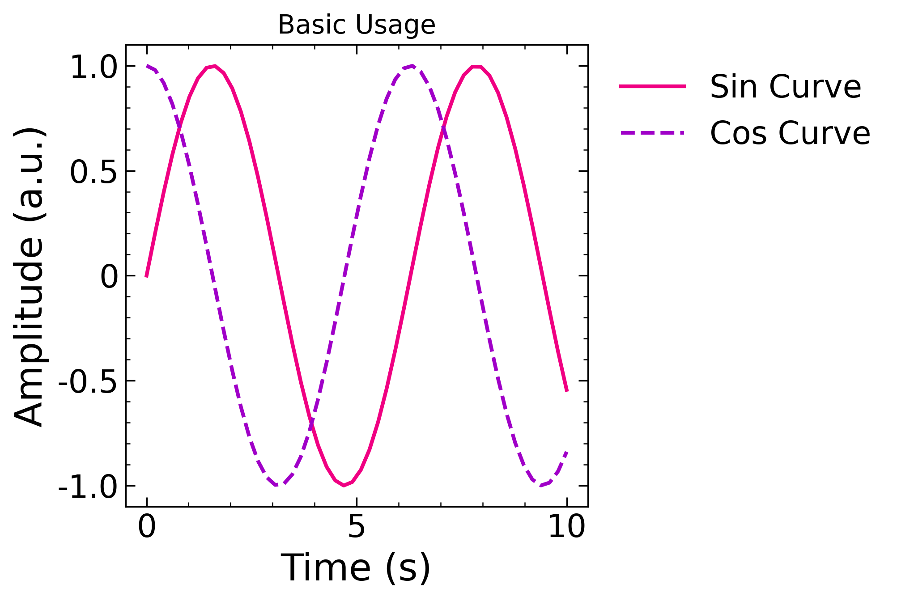
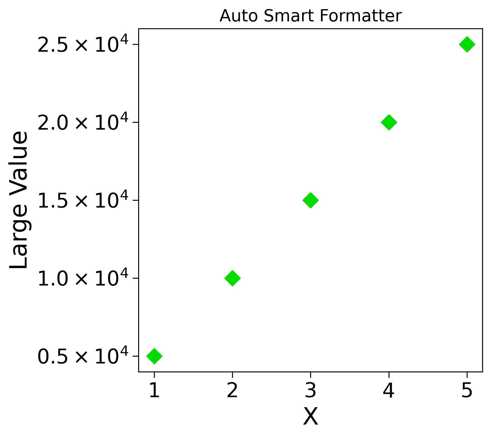
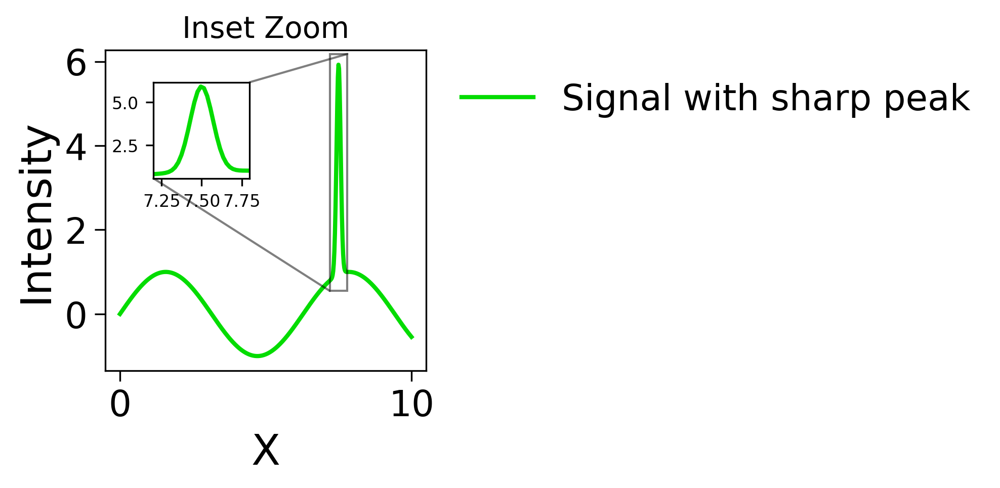
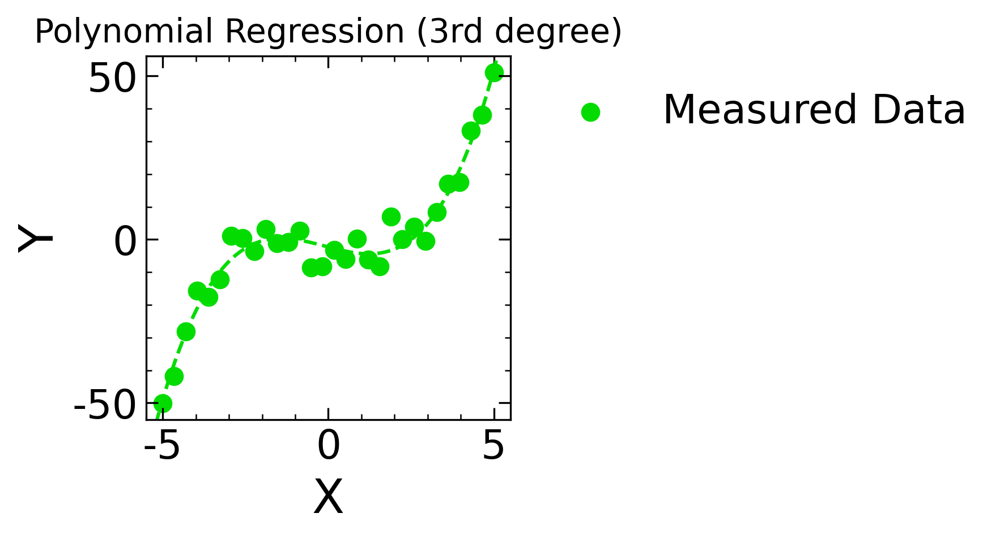
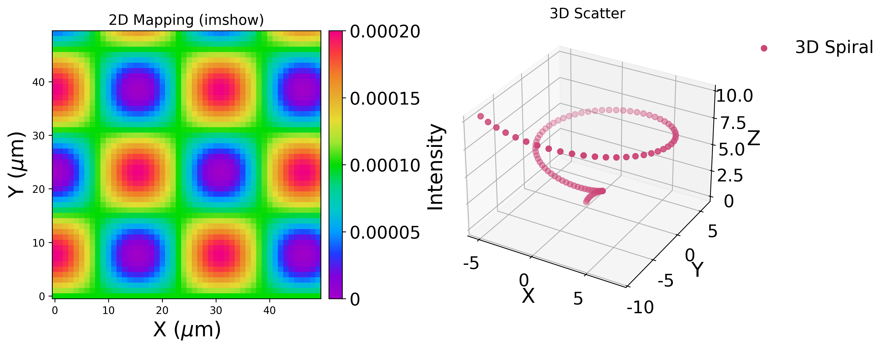
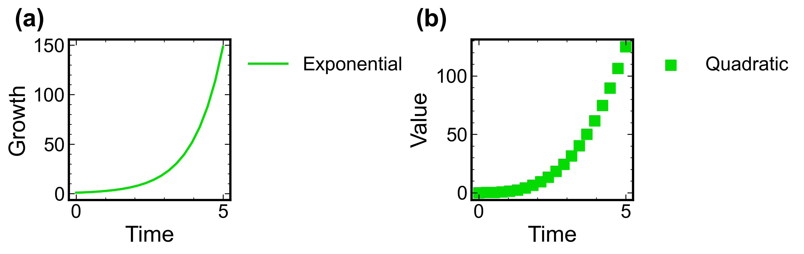

# symple_plot

`symple_plot` は、Matplotlibをベースにした研究・データ解析用の強力なグラフ描画ラッパーライブラリです。
論文やプレゼンテーションでそのまま使える美しい図を、最小限のコードで生成することを目的に設計されています。

## ✨ 主な特徴 (Features)

* **Auto Smart Formatter**: 軸のスケールを自動解析し、`5.0 × 10^4` のような美しい科学的記数法に自動フォーマットします。複数のデータ間で指数も統一されます。
* **Inset Zoom (自動拡大図)**: 範囲 (`xlim` または `ylim`) を指定するだけで、データの該当部分を自動探索し、小窓（Inset）として拡大描画します。
* **GrADS & Perceptually Uniform Colormaps**: 気象学で人気のGrADSカラーマップを標準搭載。他にも `turbo`, `plasma` などの知覚的均等カラーマップを視認性の高い範囲に絞って適用します。
* **多項式回帰 (Regression)**: 任意の次数の回帰曲線を自動で引き、係数やR2スコアを1つのCSVファイル (`regression_results.csv`) に追記保存します。
* **ワンライナー設定**: 軸ラベル、凡例、対数軸、範囲、目盛りの非表示などを1行の引数で完結させます。

---

## 📦 インストール (Installation)

GitHubから直接インストールできます。（※Privateリポジトリの場合はアクセストークンが必要です）

```bash
pip install git+[https://github.com/time-noodles/symple_plot.git](https://github.com/time-noodles/symple_plot.git)

```

## 🚀 基本的な使い方 (Basic Usage)

`create_symple_plots` を使ってグラフ枠を生成し、`plot` や `scatter` メソッドを呼び出します。

```python
import numpy as np
import matplotlib.pyplot as plt
from symple_plot import create_symple_plots

# 1行1列のグラフを生成
fig, sp = create_symple_plots(nrows=1, ncols=1)

x = np.linspace(0, 10, 50)
y1 = np.sin(x)
y2 = np.cos(x)

# データをリストで渡し、ラベルや引数を指定するだけ
sp.plot(
    [x, x], [y1, y2],
    alab=["Time (s)", "Amplitude (a.u.)"],
    lab=["Sample A", "Sample B"],
    linestyle=['-', '--'],
    linewidth=2
)

plt.show()

```

**▼ 出力例:**


---

## 🛠 機能リファレンスと実例 (Examples)

### 1. 指数の自動統一と科学的記数法

大きな桁数のデータをプロットすると、軸全体で指数が統一され、`$0.5 \times 10^4$` のように美しくフォーマットされます。

```python
fig, sp = create_symple_plots(1, 1)

x = np.linspace(1, 5, 5)
y = np.array([5000, 10000, 15000, 20000, 25000])

sp.scatter(x, y, alab=["X", "Large Value"])

```

**▼ 出力例:**


### 2. Inset Zoom（自動探索・拡大小窓）

特定の部分を強調したい場合、`add_inset_zoom` メソッドを使います。範囲を指定するだけでY方向のスケールは自動計算されます。

```python
fig, sp = create_symple_plots(1, 1)

x = np.linspace(0, 10, 500)
y = np.sin(x) + 5 * np.exp(-((x - 7.5)**2) / 0.01)

sp.plot(x, y, alab=["X", "Intensity"])

# x=7.2〜7.8の範囲を指定すると、Yの範囲を自動探索して左上に拡大図を生成
sp.add_inset_zoom(xlim=[7.2, 7.8], bounds='upper left')

```

**▼ 出力例:**


### 3. 多項式回帰 (Regression)

散布図を描画し、そのまま `Regression` を呼ぶことで近似曲線を引けます。結果はCSVに追記されます。

```python
fig, sp = create_symple_plots(1, 1)

x = np.linspace(-5, 5, 30)
y = 0.5 * x**3 - 2 * x + np.random.normal(0, 5, 30)

sp.scatter(x, y, alab=["X", "Y"])

# 3次関数でフィッティングし、結果をCSVに保存
sp.Regression(regr=3, directory='./')

```

**▼ 出力例:**


### 4. 画像プロット (Imshow) と 3D プロット

2Dマッピング画像や3D空間のプロットもサポートしています。

```python
fig, sp_arr = create_symple_plots(1, 2, figsize=(12, 5))

# --- パネル1: Imshow ---
sp1 = sp_arr[0]
z_im = np.random.rand(50, 50) * 1e-4
sp1.imshow(
    [np.linspace(0, 5, 50)], [np.linspace(0, 5, 50)], z_im,
    vmax=1e-4, alab=["X (um)", "Y (um)", "Intensity"]
)

# --- パネル2: 3D Scatter ---
sp_arr[1].ax.remove()
ax_3d = fig.add_subplot(1, 2, 2, projection='3d')
sp2 = symple_plot(ax_3d)

z_3d = np.linspace(0, 10, 100)
sp2.tdscatter(
    np.sin(z_3d), np.cos(z_3d), z_3d,
    alab=["X", "Y", "Z"]
)

```

**▼ 出力例:**


---

### 5. 論文・プレゼン用ユーティリティ (Auto Style & Labels)

論文やスライド作成を加速するため、描画スタイルの一括適用（`style`）と、各パネルへの `(a)`, `(b)` ラベルの自動付与（`auto_label`）をサポートしています。

```python
# style='slide' で太字・大きな文字に設定。auto_label=True で (a), (b) を自動付与
fig, sp_arr = create_symple_plots(1, 2, figsize=(10, 4), style='slide', auto_label=True)

x = np.linspace(0, 5, 20)
sp_arr[0].plot(x, np.exp(x), alab=["Time", "Growth"], lab="Exponential")
sp_arr[1].scatter(x, x**3, alab=["Time", "Value"], size=80, marker='s', lab="Quadratic")
```

**▼ 出力例:**


## ⚙️ パラメータ一覧 (Kwargs Reference)

引数の適用先に応じて、2つの表に分けています。

### 1. `create_symple_plots` の引数 (グラフ枠の生成・初期設定)

| 引数名 | 型 | 説明 |
| --- | --- | --- |
| `style` | str | `'paper'` または `'slide'` で描画スタイルを一括適用 |
| `auto_label`| bool | `True`で各パネルの左上に (a), (b)... と自動でラベルを付与 |

### 2. 各種描画メソッドの引数 (plot, scatter, imshow, tdscatter 等)

| 引数名 | 型 | 説明 |
| --- | --- | --- |
| `alab` | list | 軸ラベルを指定 `[xlabel, ylabel, (zlabel)]` |
| `lab` | list/str | 凡例のテキスト |
| `cx` / `cy` | list | 軸の描画範囲を固定 `[min, max]` |
| `logx` / `logy` | bool | 軸を対数スケールにする |
| `nox` / `noy` | bool | 軸の目盛りラベルのみを非表示にする |
| `zoom` | str | 指定したデータに合わせて枠を自動拡大する ('x', 'y', 'xy') |
| `marker` / `size` | - | [scatter等] マーカー形状とサイズ |
| `linestyle` / `linewidth` | - | [plot等] 線の種類と太さ |

---

### 6. データ整形・ファイル操作ユーティリティ

グラフ描画以外にも、実験データの整理や前処理に役立つ関数群をそのままインポートして使用できます。

```python
import numpy as np
from symple_plot import valid_xy, pad_list, straighten_path, del_file

# ==========================================
# データの整形ツール
# ==========================================
# 1. 欠損値 (NaN) を含むデータから有効なペアだけを抽出
x = np.array([1, 2, np.nan, 4])
y = np.array([10, np.nan, 30, 40])
clean_x, clean_y = valid_xy(x, y)
print("Valid:", clean_x, clean_y) # 出力: [1. 4.] [10. 40.]

# 2. 長さの異なるリストをNaNで埋めて長さを揃える
data1 = [1, 2, 3]
data2 = [4, 5, 6, 7, 8]
padded_data = pad_list([data1, data2])

# ==========================================
# ファイル操作ツール
# ==========================================
# 3. フォルダ内のファイルを「自然順 (1, 2, ..., 10)」でソートして取得
orted_files = straighten_path('./my_data_folder')

# 4. 使い終わった一時ファイル等のリストを一括削除
del_file(sorted_files)
```

## 謝辞 (Acknowledgments)
The core functionalities and documentation of this library were developed with the assistance of an AI language model (Google Gemini).

---

Copyright (c) 2026 Your Name. All rights reserved.