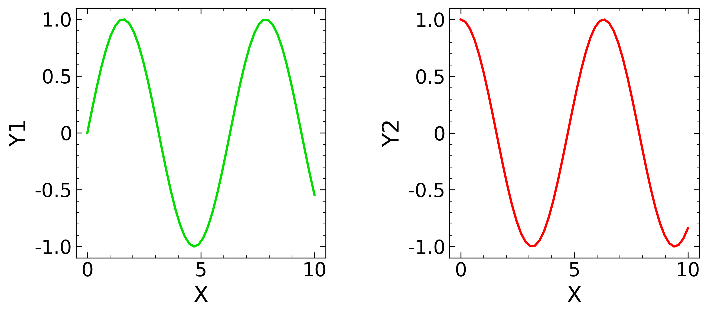
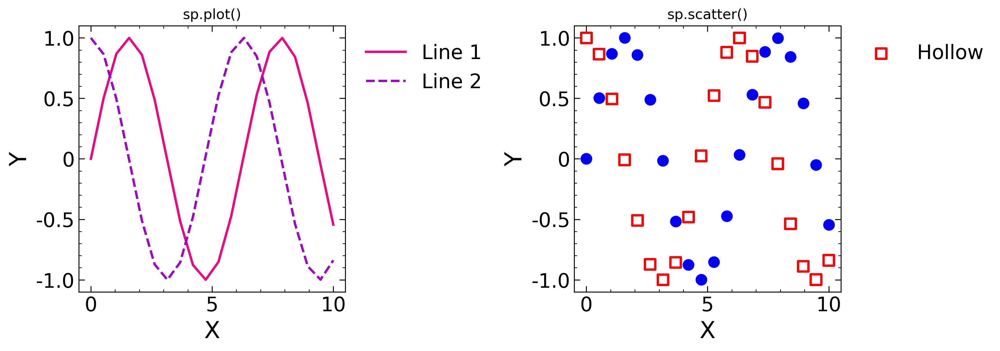
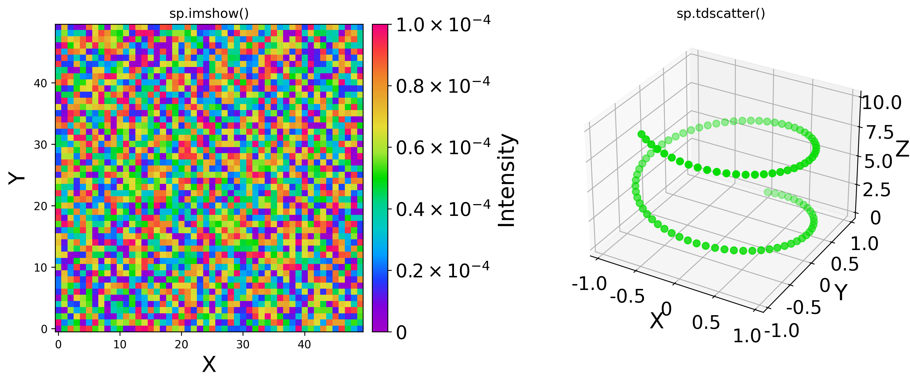

# symple_plot

`symple_plot` は、Matplotlibをベースにした研究・データ解析用の強力なグラフ描画ラッパーライブラリです。
論文やプレゼンテーションでそのまま使える美しい図を、最小限のコードで生成することを目的に設計されています。

## ✨ 主な特徴 (Features)

* **Auto Smart Formatter**: 軸のスケールを自動解析し、`5.0 × 10^4` のような美しい科学的記数法に自動フォーマットします。複数のデータ間で指数も統一されます。
* **Inset Zoom (自動拡大図)**: 範囲 (`cx` または `cy`) を指定するだけで、データの該当部分を自動探索し、小窓（Inset）として拡大描画します。小窓の中でも目盛り非表示などの基本機能が使えます。
* **重ね描きへの完全対応**: `sp.plot` を複数回呼び出しても、すべてのプロット要素が枠内に収まるよう自動的に軸範囲が拡張・調整されます。
* **隙間なしグリッド (Flush Grid)**: `flush=True` を指定するだけで、パネル間の余白をゼロにし、軸を完全に共有した美しいマトリックス状のプロットを生成できます。
* **高度な回帰分析 (Optuna搭載)**: 任意の次数の多項式回帰や、ユーザー定義関数による`非線形フィッティング`を自動実行します。`SciPy`の差分進化法を用いた大域的最適化にも対応しています。

---

## 📦 インストール (Installation)

GitHubから直接インストールできます。

```bash
pip install git+[https://github.com/time-noodles/symple_plot.git](https://github.com/time-noodles/symple_plot.git)
```
※ `remove_background` などの一部の解析ユーティリティを使用する場合は `pip install pybeads` も合わせて実行してください。

---

## 🚀 クイックスタート (Quick Start)

左がMatplotlibのデフォルト、右が `symple_plot` を使用した出力です。
データをリストで渡し、ラベルを指定するだけで、自動的に内向きの目盛りや美しいフォーマットが適用されます。

```python
import numpy as np
import matplotlib.pyplot as plt
from symple_plot import symple_plot

fig = plt.figure(figsize=(12, 5))
x = np.linspace(0, 10, 50)
y1, y2 = np.sin(x), np.cos(x)

# --- 左: Matplotlib Default ---
ax1 = fig.add_subplot(121)
ax1.plot(x, y1, label="Sample A")
ax1.plot(x, y2, label="Sample B")
ax1.set_xlabel("Time (s)")
ax1.set_ylabel("Amplitude (a.u.)")
ax1.legend()
ax1.set_title("Matplotlib Default")

# --- 右: symple_plot ---
ax2 = fig.add_subplot(122)
sp = symple_plot(ax2)
sp.plot([x, x], [y1, y2], alab=["Time (s)", "Amplitude (a.u.)"], lab=["Sample A", "Sample B"])
ax2.set_title("symple_plot")

plt.show()
```

**▼ 出力例:**


---

## 🔲 グラフ枠の生成 (`create_symple_plots`)

`symple_plot` では、単一または複数のグラフ枠（パネル）を一括で生成し、自動的に最適なサイズを計算する専用関数 `create_symple_plots` を用意しています。
論文やスライド用のスタイル設定や、グリッドの共有設定などもこの関数で一括指定できます。

| `create_symple_plots` の基本・固有引数 | 型 | 説明 |
| --- | --- | --- |
| `nrows`, `ncols` | int | グラフパネルの行数と列数を指定します（デフォルト: 1）。 |
| `figsize` | tuple | グラフ全体のサイズ `(width, height)`。未指定時はパネル数から自動計算されます。 |
| `style` | str | `'paper'` または `'slide'` で描画スタイル（フォントや線の太さ）を一括適用します。 |
| `auto_label`| bool | `True`にすると、各パネルの左上に (a), (b)... と自動でラベルを付与します。 |
| `sharex` / `sharey`| bool/str | グリッド時に軸を共有します (`True`, `'col'`, `'row'`)。内側の目盛りラベルは自動で省略されます。 |
| `flush` | bool | `True`にするとパネル間の隙間をゼロにし、完全な共有グリッドを作成します。 |

```python
import numpy as np
import matplotlib.pyplot as plt
from symple_plot import create_symple_plots

x = np.linspace(0, 10, 50)
y1, y2 = np.sin(x), np.cos(x)

# 1行2列のグラフを生成（fig と symple_plotインスタンスの配列 が返ります）
fig, sp_arr = create_symple_plots(nrows=1, ncols=2, figsize=(10, 4))

# 配列のインデックスで各パネルにアクセスし、描画メソッドを呼び出す
sp_arr[0].plot(x, y1, alab=["X", "Y1"])
sp_arr[1].plot(x, y2, alab=["X", "Y2"], col='red')

plt.show()
```

**▼ 出力例:**


---

## 🎨 コア描画メソッド (Core Plotting Methods)

`symple_plot` インスタンス（例: `sp`）から呼び出せる主要な描画メソッドです。

### 1. `sp.plot()` と `sp.scatter()`
標準的な折れ線グラフと散布図です。データ（`X`, `Y`）にリストのリストを渡すことで、一括プロットが可能です。

| 固有の引数名 | 適用先 | 型 | 説明 |
| --- | --- | --- | --- |
| `linestyle` | plot | str/list | 線のスタイル (`'-'`, `'--'`, `':'` など)。複数指定可。 |
| `linewidth` | plot/scatter | float | 線の太さ、または中抜き時の枠線の太さ |
| `marker` | scatter | str/list | マーカーの形状 (`'o'`, `'s'`, `'^'` など)。複数指定可。 |
| `size` | scatter | float | マーカーのサイズ (デフォルト: 40) |
| `hollow` | scatter | bool | `True`を指定すると枠線だけの**中抜き（白抜き）マーカー**になる |
| `facecolor` | scatter | str | マーカーの塗りつぶし色。`'none'` で中抜きと同等になる。 |

```python
import numpy as np
import matplotlib.pyplot as plt
from symple_plot import create_symple_plots

fig, sp_arr = create_symple_plots(1, 2, figsize=(12, 5))
x = np.linspace(0, 10, 20)

# 左: sp.plot (2つのデータを一括プロット)
sp_arr[0].plot([x, x], [np.sin(x), np.cos(x)], alab=["X", "Y"], lab=["Line 1", "Line 2"], linestyle=['-', '--'])

# 右: sp.scatter (塗りつぶしと中抜きの比較)
sp_arr[1].scatter(x, np.sin(x), alab=["X", "Y"], lab="Filled", marker='o', size=80, col='blue')
sp_arr[1].scatter(x, np.cos(x), lab="Hollow", marker='s', size=80, hollow=True, linewidth=2.0, col='red')

plt.show()
```


### 2. `sp.imshow()` と `sp.tdscatter()`
2Dのカラーマップ画像（ヒートマップ）と、3D空間への散布図を描画します。

| 固有の引数名 | 適用先 | 型 | 説明 |
| --- | --- | --- | --- |
| `vmax` | imshow | float | カラーマップの最大値 |
| `col` | imshow | str | カラーマップ名 (`'grads'`, `'jet'`, `'turbo'` など) |
| `logz` | 両方 | bool | Z軸、またはカラーバーの目盛りを対数スケールにする |
| `cz` | tdscatter | list | Z軸の描画範囲の固定 `[zmin, zmax]` |

```python
import numpy as np
import matplotlib.pyplot as plt
from symple_plot import create_symple_plots, symple_plot

fig, sp_arr = create_symple_plots(1, 2, figsize=(12, 5))

# 左: Imshow
z_im = np.random.rand(50, 50) * 1e-4
sp_arr[0].imshow([np.linspace(0, 5, 50)], [np.linspace(0, 5, 50)], z_im, vmax=1e-4, alab=["X", "Y", "Intensity"])

# 右: 3D Scatter
sp_arr[1].ax.remove()
ax_3d = fig.add_subplot(1, 2, 2, projection='3d')
sp2 = symple_plot(ax_3d)
z_3d = np.linspace(0, 10, 100)
sp2.tdscatter(np.sin(z_3d), np.cos(z_3d), z_3d, alab=["X", "Y", "Z"])

plt.show()
```


---

## ✨ symple_plot 固有の共通引数 (Unique Parameters)

Matplotlibの複数行のコードを1行に短縮するため、`symple_plot` の各種描画メソッド（`plot`, `scatter`, `imshow` 等）には以下の**固有の共通引数**が用意されています。これらはどの描画メソッドでも呼び出し時に同時に指定できます。

| 引数名 | 型 | 説明 (機能と名前の由来) |
| --- | --- | --- |
| `alab` | list/str | **A**xis **Lab**el. 軸ラベルを `["X軸", "Y軸"]` のリスト形式で一括指定します。 |
| `lab` | list/str | **Lab**el. 凡例に表示するテキストを指定します。 |
| `loc` | str | 凡例の配置。`'inline'` を指定すると、プロット線の末端に配置する**インライン凡例**になります。 |
| `cx` / `cy` | list | **C**rop **X** / **C**rop **Y**. データの描画範囲を `[min, max]` で固定します。(`xlim`, `ylim` の代替) |
| `nox` / `noy` | bool | **No X**-ticks / **No Y**-ticks. 軸の目盛り数値（ラベル）のみを非表示にします。(`nonx`, `nony` でも可) |
| `logx` / `logy` | bool | 軸を対数（Log）スケールに変更します。 |
| `zoom` | str | `'x'`, `'y'`, `'xy'` を指定すると、今回渡したデータの範囲に合わせてグラフ枠全体を強制的にズーム（拡大）します。 |
| `col` | str/list | **Col**or. プロットの色を指定します。`'grads'`, `'turbo'`, `'mode1'` などの独自カラーマップ名や、色のリストも渡せます。 |
| `vx` / `hy` | list/float | **V**ertical **X** / **H**orizontal **Y**. 指定した座標に垂直線または水平線を引きます。 |
| `alab_fs` | int | 軸ラベルのフォントサイズ (デフォルト: 20) |
| `tick_fs` | int | 目盛り数値のフォントサイズ (デフォルト: 17) |
| `lab_fs` | int | 凡例・インラインラベルのフォントサイズ (デフォルト: `tick_fs` と同じ) |
| `margin` | float | 自動スケーリング時の余白割合 (デフォルト: 0.05) |
| `aspect` | float | グラフのアスペクト比を指定（例: `1.0` で正方形） |

---

## 📚 応用ギャラリー・便利ツール (Advanced Gallery & Utilities)

ライブラリの真価を発揮する高度なレイアウト機能や特殊な解析ツールは、すべて以下の **Wiki** にまとめています。

1. 👉 **[応用ギャラリー (Gallery)](wiki/Gallery.md)**
   * **レイアウト:** 隙間なしグリッド (`flush`), 共有軸 (`sharex`), 論文用自動ラベル (`auto_label`)
   * **視線誘導:** インセットズーム (`zoomx`), インライン凡例 (`loc='inline'`), 強制ズーム (`zoom`)
   * **軸・フォーマット:** 第二軸とスケール変換 (`twinx`, `secondary_xaxis`)
2. 👉 **[解析・ユーティリティ (Utilities)](wiki/Utilities.md)**
   * **解析ツール:** 高度な回帰分析と最適化 (`Regression`), バックグラウンド除去 (`remove_background`)
   * **データ処理:** 範囲データの抽出 (`get_yrange`), リスト長の自動パディング (`pad_list`)
   * **ファイル操作:** 自然順ソート (`straighten_path`), 一括削除 (`del_file`)

---

## 謝辞 (Acknowledgments)
The core functionalities and documentation of this library were developed with the assistance of an AI language model (Google Gemini).

---

Copyright (c) 2026 Your Name. All rights reserved.