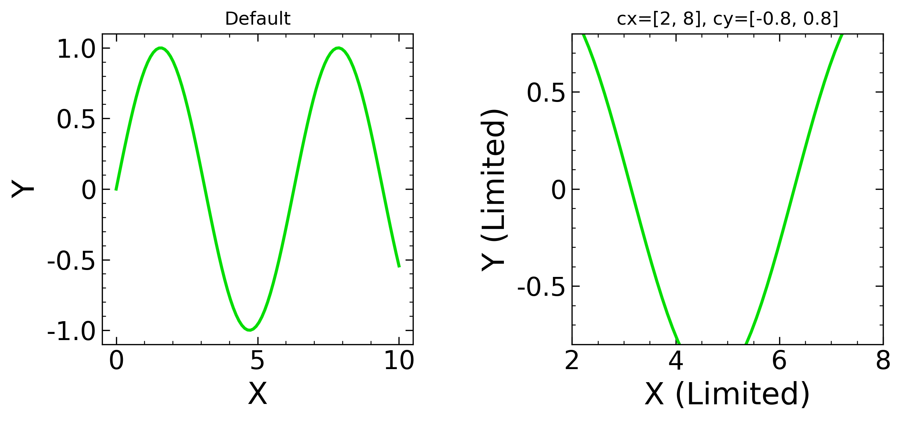
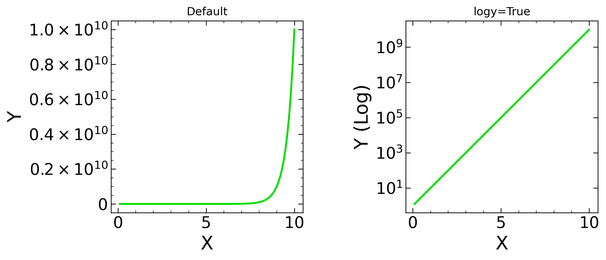
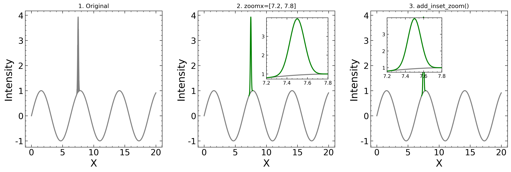
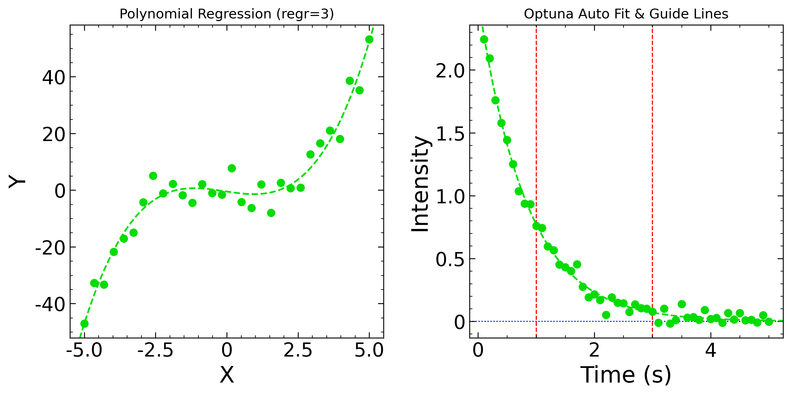
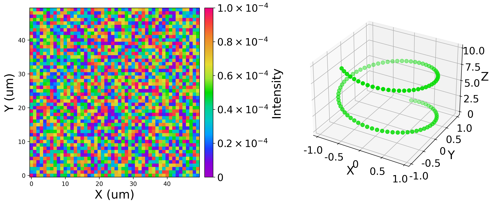
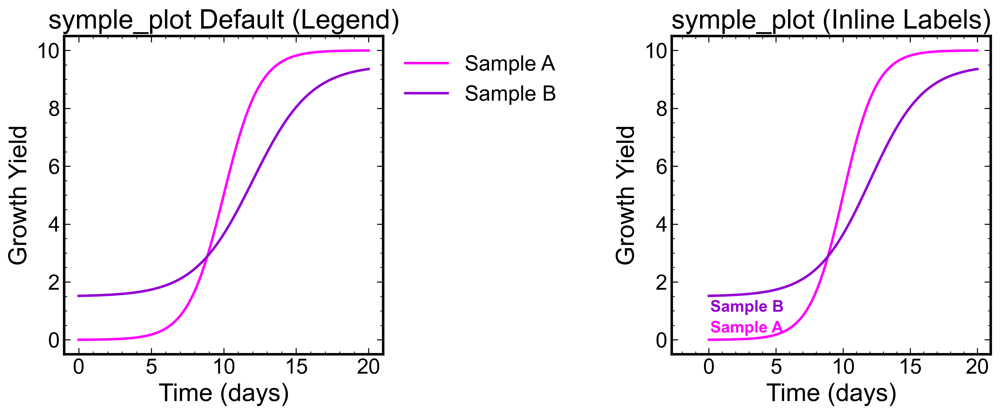

# symple_plot

`symple_plot` は、Matplotlibをベースにした研究・データ解析用の強力なグラフ描画ラッパーライブラリです。
論文やプレゼンテーションでそのまま使える美しい図を、最小限のコードで生成することを目的に設計されています。

## ✨ 主な特徴 (Features)

* **Auto Smart Formatter**: 軸のスケールを自動解析し、`5.0 × 10^4` のような美しい科学的記数法に自動フォーマットします。複数のデータ間で指数も統一されます。
* **Inset Zoom (自動拡大図)**: 範囲 (`xlim` または `ylim`) を指定するだけで、データの該当部分を自動探索し、小窓（Inset）として拡大描画します。
* **GrADS & Perceptually Uniform Colormaps**: 気象学で人気のGrADSカラーマップを標準搭載。他にも `turbo`, `plasma` などの知覚的均等カラーマップを視認性の高い範囲に絞って適用します。
* **高度な回帰分析 (Optuna搭載)**: 任意の次数の多項式回帰や、ユーザー定義関数による非線形フィッティングを自動実行します。`optuna` を用いたベイズ最適化による初期値(`p0`)の自動大域探索にも対応しています。
* **ワンライナー設定**: 軸ラベル、凡例、対数軸、範囲、垂直/水平の補助線(`vx`, `hy`)、アスペクト比などを1行の引数で完結させます。

---

## 📦 インストール (Installation)

GitHubから直接インストールできます。

```bash
pip install git+https://github.com/time-noodles/symple_plot.git
```

## 🚀 基本的な使い方 (Basic Usage)

左がMatplotlibのデフォルト、右が `symple_plot` を使用した出力です。
データをリストで渡し、ラベルを指定するだけで、自動的に内向きの目盛りや美しいフォーマットが適用されます。

```python
import numpy as np
import matplotlib.pyplot as plt
from symple_plot import symple_plot

fig = plt.figure(figsize=(12, 5))
x = np.linspace(0, 10, 50)
y1, y2 = np.sin(x), np.cos(x)

# --- 左: Matplotlib Default ---
ax1 = fig.add_subplot(121)
ax1.plot(x, y1, label="Sample A")
ax1.plot(x, y2, label="Sample B")
ax1.set_xlabel("Time (s)")
ax1.set_ylabel("Amplitude (a.u.)")
ax1.legend()
ax1.set_title("Matplotlib Default")

# --- 右: symple_plot ---
ax2 = fig.add_subplot(122)
sp = symple_plot(ax2)
sp.plot([x, x], [y1, y2], alab=["Time (s)", "Amplitude (a.u.)"], lab=["Sample A", "Sample B"])
ax2.set_title("symple_plot")

plt.show()
```

**▼ 出力例:**


---

## 🛠 機能リファレンスと実例 (Examples)

### 1. 指数の自動統一と科学的記数法

大きな桁数のデータをプロットする際、`symple_plot` は軸全体で指数を自動的に統一し、`$2.5 \times 10^4$` のように美しくフォーマットします。

```python
import numpy as np
import matplotlib.pyplot as plt
from symple_plot import symple_plot

fig = plt.figure(figsize=(12, 5))
x = np.linspace(1, 5, 5)
y = np.array([5000, 10000, 15000, 20000, 25000])

# --- 左: Matplotlib Default ---
ax1 = fig.add_subplot(121)
ax1.scatter(x, y)
ax1.set_xlabel("X")
ax1.set_ylabel("Large Value")
ax1.set_title("Matplotlib Default")

# --- 右: symple_plot ---
ax2 = fig.add_subplot(122)
sp = symple_plot(ax2)
sp.scatter(x, y, alab=["X", "Large Value"])
ax2.set_title("symple_plot")

plt.show()
```

**▼ 出力例:**


### 2. 軸の描画範囲の固定 (`cx`, `cy`)
特定の範囲だけに描画を制限したい場合は、`cx` または `cy` に `[min, max]` を渡します。左の図はデフォルト、右の図は範囲を固定した例です。

```python
import numpy as np
from symple_plot import create_symple_plots

fig, sp_arr = create_symple_plots(1, 2, figsize=(12, 4))
x = np.linspace(0, 10, 100)

sp_arr[0].plot(x, np.sin(x), alab=["X", "Y"])
sp_arr[0].ax.set_title("Default")
sp_arr[1].plot(x, np.sin(x), alab=["X (Limited)", "Y (Limited)"], cx=[2, 8], cy=[-0.8, 0.8])
sp_arr[1].ax.set_title("cx=[2, 8], cy=[-0.8, 0.8]")
```


### 3. 対数スケールへの変更 (`logx`, `logy`)
`logy=True` を引数に加えるだけで、Y軸が対数スケールに切り替わります。

```python
import numpy as np
from symple_plot import create_symple_plots

fig, sp_arr = create_symple_plots(1, 2, figsize=(12, 4))
x = np.linspace(0.1, 10, 100)

sp_arr[0].plot(x, 10**x, alab=["X", "Y"])
sp_arr[0].ax.set_title("Default")
sp_arr[1].plot(x, 10**x, alab=["X", "Y (Log)"], logy=True)
sp_arr[1].ax.set_title("logy=True")
```


### 4. 目盛り数値の非表示 (`nox`, `noy`)
目盛りや枠線は残したまま、数値ラベルだけを消したい場合は `nox=True` または `noy=True` を指定します。

```python
import numpy as np
from symple_plot import create_symple_plots

fig, sp_arr = create_symple_plots(1, 2, figsize=(12, 4))
x = np.linspace(0, 10, 100)

sp_arr[0].plot(x, np.sin(x), alab=["X", "Y"])
sp_arr[0].ax.set_title("Default")
sp_arr[1].plot(x, np.sin(x), alab=["X", "Y (Hidden Ticks)"], noy=True)
sp_arr[1].ax.set_title("noy=True")
```


### 5. Inset Zoom（自動探索・拡大小窓）

データの特定の部分を強調したい場合、小窓（Inset Zoom）を簡単に作成できます。
引数 `zoomx` を渡して1行で自動生成する方法と、描画後に `add_inset_zoom` メソッドで明示的に範囲を指定する方法があり、どちらもY方向のスケールや最適な配置場所は自動で計算されます。

```python
import numpy as np
from symple_plot import create_symple_plots

# 1行3列のグラフを生成
fig, sp_arr = create_symple_plots(1, 3, figsize=(15, 5))

x_bg = np.linspace(0, 20, 200)
y_bg = np.sin(x_bg)
x_peak = np.linspace(7.2, 7.8, 50)
y_peak = np.sin(x_peak) + 3 * np.exp(-((x_peak - 7.5)**2) / 0.01)

# 全体を結合してソート (左のプロット用)
x_all = np.concatenate([x_bg, x_peak])
y_all = np.concatenate([y_bg, y_peak])
sort_idx = np.argsort(x_all)
x_all, y_all = x_all[sort_idx], y_all[sort_idx]

# --- 1. Original (通常プロット) ---
sp_arr[0].plot(x_all, y_all, alab=["X", "Intensity"], col='gray')
sp_arr[0].ax.set_title("1. Original")

# --- 2. zoomx=[] で指定 ---
sp_arr[1].plot(x_bg, y_bg, col='gray', alab=["X", "Intensity"])
sp_arr[1].plot(x_peak, y_peak, col='green', zoomx=[7.2, 7.8])
sp_arr[1].ax.set_title("2. zoomx=[7.2, 7.8]")

# --- 3. add_inset_zoom で指定 ---
sp_arr[2].plot(x_bg, y_bg, col='gray', alab=["X", "Intensity"])
sp_arr[2].plot(x_peak, y_peak, col='green')
sp_arr[2].add_inset_zoom(xlim=[7.2, 7.8], bounds='upper left')
sp_arr[2].ax.set_title("3. add_inset_zoom()")
```

**▼ 出力例:**


### 6. 個別カラー指定と強制ズーム (Custom Color & Auto Zoom)

`col` 引数で特定のプロットだけ色を変更したり、`zoom` 引数を使って「後から追加したデータ」の範囲にグラフ全体をピタッとフォーカスさせることができます。

```python
import numpy as np
from symple_plot import create_symple_plots

fig, sp_arr = create_symple_plots(1, 3, figsize=(15, 4))
x_bg, y_bg = np.linspace(0, 20, 100), np.sin(np.linspace(0, 20, 100))
x_target, y_target = np.linspace(5, 10, 50), np.sin(np.linspace(5, 10, 50))

# zoom='x', zoom='y', zoom='xy' で特定データの範囲にグラフを合わせる
for i, title, zoom in zip(range(3), ["zoom='x'", "zoom='y'", "zoom='xy'"], ['x', 'y', 'xy']):
    sp = sp_arr[i]
    sp.plot(x_bg, y_bg, col='gray', lab="Background", linestyle=['--'], alab=["X", "Y"])
    sp.plot(x_target, y_target, col='red', lab="Target", zoom=zoom, linewidth=3)
    sp.ax.set_title(title, fontsize=14)
```

**▼ 出力例:**


### 7. 回帰分析と補助線 (Regression & Guide Lines)

`Regression` メソッドは、引数に「整数」を渡せば多項式回帰を、「関数オブジェクト」を渡せば非線形フィッティングを実行します。`auto_p0=True` を指定すると、Optunaによるベイズ最適化で最適な初期値を自動探索します。

```python
import numpy as np
from symple_plot import create_symple_plots

fig, sp_arr = create_symple_plots(1, 2, figsize=(12, 5))

# --- パネル1: 多項式回帰 (3次関数) ---
sp1 = sp_arr[0]
x1 = np.linspace(-5, 5, 30)
y1 = 0.5 * x1**3 - 2 * x1 + np.random.normal(0, 5, 30)
sp1.scatter(x1, y1, alab=["X", "Y"], lab="Data")
sp1.Regression(regr=3) # 3次関数でフィッティング
sp1.ax.set_title("Polynomial Regression (regr=3)")

# --- パネル2: 任意関数フィッティングと補助線 ---
sp2 = sp_arr[1]
x2 = np.linspace(0.1, 5, 50)
y2 = 2.5 * np.exp(-1.2 * x2) + np.random.normal(0, 0.05, 50)

# vx=[1, 3] で垂直な補助線を、hy=0 で水平線を引く
sp2.scatter(x2, y2, alab=["Time (s)", "Intensity"], lab="Data",
            vx=[1, 3], vcol='red', vstyle='--', vwidth=1.5,
            hy=0, hcol='blue', hstyle=':', hwidth=1.0)

# 任意の関数を定義してフィッティング
def exp_decay(x, a, b):
    return a * np.exp(-b * x)

# Optunaを使用して初期値を自動探索
sp2.Regression(regr=exp_decay, auto_p0=True, n_trials=50, bounds=([0, 0], [10, 5]))
sp2.ax.set_title("Optuna Auto Fit & Guide Lines")
```

**▼ 出力例:**


### 8. 画像プロット (Imshow) と 3D プロット

2Dマッピング画像や3D空間のプロットもサポートしています。

```python
import numpy as np
from symple_plot import create_symple_plots, symple_plot

fig, sp_arr = create_symple_plots(1, 2, figsize=(12, 5))

# --- パネル1: Imshow ---
sp1 = sp_arr[0]
z_im = np.random.rand(50, 50) * 1e-4
sp1.imshow(
    [np.linspace(0, 5, 50)], [np.linspace(0, 5, 50)], z_im,
    vmax=1e-4, alab=["X (um)", "Y (um)", "Intensity"]
)

# --- パネル2: 3D Scatter ---
sp_arr[1].ax.remove()
ax_3d = fig.add_subplot(1, 2, 2, projection='3d')
sp2 = symple_plot(ax_3d)

z_3d = np.linspace(0, 10, 100)
sp2.tdscatter(
    np.sin(z_3d), np.cos(z_3d), z_3d,
    alab=["X", "Y", "Z"]
)
```

**▼ 出力例:**


### 9. 論文・プレゼン用ユーティリティ (Auto Style & Labels)

論文やスライド作成を加速するため、描画スタイルの一括適用（`style`）と、各パネルへの `(a)`, `(b)` ラベルの自動付与（`auto_label`）をサポートしています。

```python
import numpy as np
from symple_plot import create_symple_plots

# style='slide' で太字・大きな文字に設定。auto_label=True で (a), (b) を自動付与
fig, sp_arr = create_symple_plots(1, 2, figsize=(10, 4), style='slide', auto_label=True)

x = np.linspace(0, 5, 20)
sp_arr[0].plot(x, np.exp(x), alab=["Time", "Growth"], lab="Exponential")
sp_arr[1].scatter(x, x**3, alab=["Time", "Value"], size=80, marker='s', lab="Quadratic")
```

**▼ 出力例:**


### 10. インラインラベル (Inline Labels)

データの右端または左端に直接凡例テキストを配置する「インラインラベル」に対応しています。`loc='inline'` を指定すると、データの間隔が広い（文字が被りにくい）方を自動で判定し、プロットと同じ色でラベルを描画します。
ラベルが被る場合は、`inline_dy` と `inline_fs` を用いて位置やサイズを微調整できます。

```python
import numpy as np
from symple_plot import create_symple_plots

def logistic(x, L, k, x0):
    return L / (1 + np.exp(-k * (x - x0)))

fig, sp = create_symple_plots(1, 1, figsize=(8, 5))
x = np.linspace(0, 20, 100)
y1 = logistic(x, 10, 0.8, 10)
y2 = logistic(x, 8, 0.5, 12) + 1.0

# loc='inline' でラベルを配置。データ末端に潜り込むように自動調整されます。
sp.plot([x, x], [y1, y2], 
        alab=["Time (days)", "Yield (mg)"], 
        lab=["Strain A (Wild)", "Strain B (Mutant)"], 
        loc='inline',
        lab_fs=12,
        inline_dy=[0.3, -0.3]) # ラベルが近い場合に上下に微調整
```

**▼ 出力例:**


---

## ⚙️ パラメータ一覧 (Kwargs Reference)

引数の適用先に応じて、2つの表に分けています。

### 1. `create_symple_plots` の引数 (グラフ枠の生成・初期設定)

| 引数名 | 型 | 説明 |
| --- | --- | --- |
| `style` | str | `'paper'` または `'slide'` で描画スタイルを一括適用 |
| `auto_label`| bool | `True`で各パネルの左上に (a), (b)... と自動でラベルを付与 |

### 2. 各種描画メソッドの引数 (plot, scatter, imshow, tdscatter 等)

| 引数名 | 型 | 説明 |
| --- | --- | --- |
| `aspect` | float | グラフのアスペクト比を指定（例: 1.0で正方形、0.5で横長） |
| `alab` | list | 軸ラベルを指定 `[xlabel, ylabel, (zlabel)]` |
| `lab` | list/str | 凡例のテキスト |
| `loc` | str | 凡例の配置。`'inline'` で線の端に直接配置（`'inline_right'`, `'inline_left'` で強制指定可） |
| `inline_dy` | float/list| [インラインラベル] 各ラベルのY座標のオフセット（例: `[0.1, -0.1]`） |
| `inline_pad`| float | [インラインラベル] ラベル描画のためにX軸を拡張する割合（デフォルト: 0.05 = 5%）|
| `axilab` | int | 軸ラベル (xlabel, ylabel) のフォントサイズ |
| `axinum` | int | 軸の目盛り数値のフォントサイズ |
| `margin` | float | 自動スケーリング時の余白割合 (デフォルト: 0.05) |
| `cx` / `cy` | list | 軸の描画範囲を固定 `[min, max]` |
| `logx` / `logy` | bool | 軸を対数スケールにする |
| `nox` / `noy` | bool | 軸の目盛りラベルのみを非表示にする |
| `zoom` | str | 今回渡したデータ範囲に枠を強制拡大 ('x', 'y', 'xy') |
| `zoomx` / `zoomy` | list | 指定範囲 `[min, max]` の拡大図（Inset Zoom小窓）を生成 |
| `col` | str/list | プロットの色を指定 ('red', 'plasma', 'mode1' 等) |
| `vx` / `hy` | list/float | 垂直線(x) / 水平線(y) を引く座標 |
| `vcol` / `hcol` | str | 垂直/水平線の色 (デフォルト: 'gray') |
| `vstyle` / `hstyle` | str | 垂直/水平線のスタイル (デフォルト: '--') |
| `marker` / `size` | - | [scatter等] マーカー形状とサイズ |
| `linestyle` / `linewidth` | - | [plot等] 線の種類と太さ |
| `auto_p0` | bool | [Regression] Trueにすると、Optunaで非線形フィッティングの初期値を自動探索する |
| `n_trials`| int  | [Regression] `auto_p0=True` の際のOptuna探索回数（デフォルト: 100） |
| `p0` / `bounds`| - | [Regression] 非線形フィッティングの初期推測値 / 探索範囲 |

---

## 🧰 その他の便利ツール (Utilities)

`symple_plot` には、グラフ描画以外にも実験データの整理やモデリングに役立つ便利な関数群が含まれています。データの前処理、ファイルの自然順ソート、Optunaを単独で呼び出すフィッティング機能などが揃っています。

詳細な使い方や実例については、以下のWikiページをご覧ください。
👉 **[データ前処理・ファイル操作・解析ユーティリティ (Wiki)](wiki/Utilities.md)**

---

## 謝辞 (Acknowledgments)
The core functionalities and documentation of this library were developed with the assistance of an AI language model (Google Gemini).

---

Copyright (c) 2026 Your Name. All rights reserved.