# symple_plot 応用ギャラリー (Gallery)

`symple_plot` の高度な機能を活用した実例集です。論文やプレゼンテーションで「あと一歩」を実現するためのレイアウトや特殊な描画方法をまとめています。

---

## 目次 (Table of Contents)

- [1. 軸とフォーマットの制御](#1-軸とフォーマットの制御)
  - [1-1. 指数の自動統一と科学的記数法](#1-1-指数の自動統一と科学的記数法)
  - [1-2. 軸の描画範囲の固定 (`cx`, `cy`)](#1-2-軸の描画範囲の固定-cx-cy)
  - [1-3. 目盛り数値の非表示 (`nox`, `noy`)](#1-3-目盛り数値の非表示-nox-noy)
  - [1-4. 枠の事前生成とネイティブ関数との連携 (`pre_set`)](#1-4-枠の事前生成とネイティブ関数との連携-pre_set)
- [2. 複数パネルとレイアウト](#2-複数パネルとレイアウト)
  - [2-1. グリッドプロットと軸の共有 (`sharex`, `sharey`)](#2-1-グリッドプロットと軸の共有-sharex-sharey)
  - [2-2. 隙間なしグリッド (Flush Grid)](#2-2-隙間なしグリッド-flush-grid)
  - [2-3. 第二軸とスケール変換 (Twin Axes & Secondary Axes)](#2-3-第二軸とスケール変換-twin-axes--secondary-axes)
- [3. 視線誘導と注釈](#3-視線誘導と注釈)
  - [3-1. Inset Zoom（自動探索・拡大小窓）](#3-1-inset-zoom自動探索拡大小窓)
  - [3-2. 個別カラー指定と強制ズーム (`zoom`)](#3-2-個別カラー指定と強制ズーム-zoom)
  - [3-3. インラインラベル (Inline Labels)](#3-3-インラインラベル-inline-labels)
  - [3-4. 論文・プレゼン用スタイルと自動ラベル (`style`, `auto_label`)](#3-4-論文プレゼン用スタイルと自動ラベル-style-auto_label)
- [4. 解析と特殊プロット](#4-解析と特殊プロット)
  - [4-1. 回帰分析と補助線 (`Regression`, `vx`, `hy`)](#4-1-回帰分析と補助線-regression-vx-hy)

---

## 1. 軸とフォーマットの制御

### 1-1. 指数の自動統一と科学的記数法
大きな桁数のデータや微小なデータをプロットする際、`symple_plot` は軸全体で指数を自動的に統一し、`$2.5 \times 10^4$` のように美しくフォーマットします。

| 引数名 | 型 | 説明 |
| --- | --- | --- |
| `alab` | list/str | 軸ラベルを指定 `[xlabel, ylabel]`。 |

```python
import numpy as np
import matplotlib.pyplot as plt
from symple_plot import create_symple_plots

# 1行2列のパネルを生成
fig, sp_arr = create_symple_plots(1, 2, figsize=(12, 5))

x = np.linspace(1, 5, 5)
y_large = np.array([5000, 10000, 15000, 20000, 25000])         # 巨大な値
y_small = np.array([0.0005, 0.0010, 0.0015, 0.0020, 0.0025])   # 微小な値

sp_arr[0].scatter(x, y_large, alab=["X", "Large Value"], size=60)
sp_arr[1].scatter(x, y_small, alab=["X", "Small Value"], col='red', size=60)

plt.show()
```
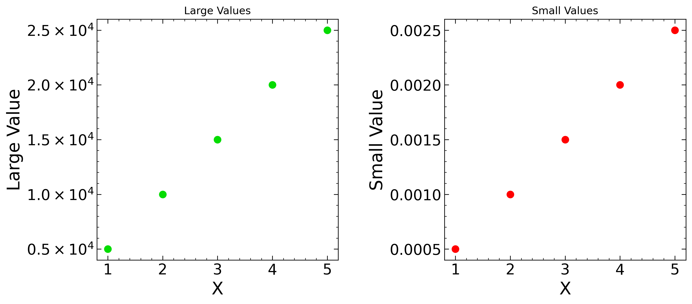

### 1-2. 軸の描画範囲の固定 (`cx`, `cy`)
特定の範囲だけに描画を制限したい場合は、`cx` または `cy` に `[min, max]` を渡します。

| 引数名 | 型 | 説明 |
| --- | --- | --- |
| `cx` | list | X軸の描画範囲を固定する `[xmin, xmax]` |
| `cy` | list | Y軸の描画範囲を固定する `[ymin, ymax]` |

```python
from symple_plot import create_symple_plots
# ... (データ準備略)
sp_arr[1].plot(x, np.sin(x), alab=["X", "Y (Limited)"], cx=[2, 8], cy=[-0.8, 0.8])
```
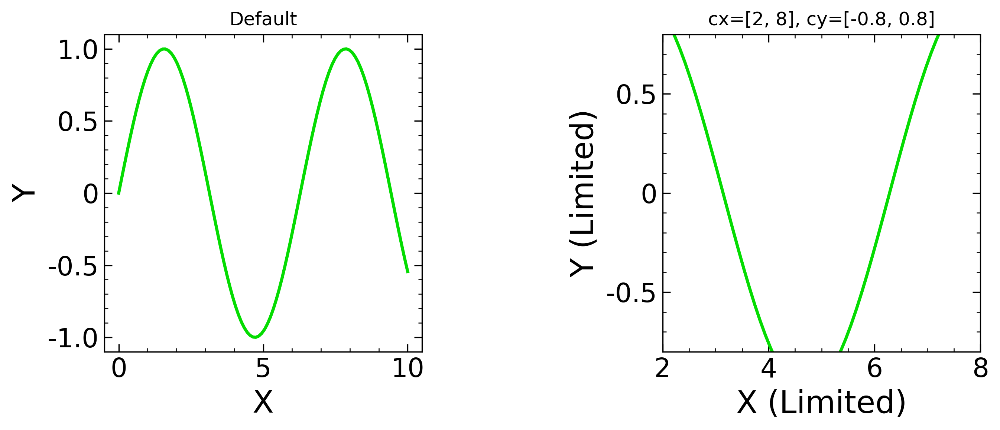

### 1-3. 目盛り数値の非表示 (`nox`, `noy`)
目盛りや枠線は残したまま、数値ラベルだけを消したい場合は `nox=True` または `noy=True` を指定します。

| 引数名 | 型 | 説明 |
| --- | --- | --- |
| `nox` / `nonx` | bool | X軸の目盛り数値（ラベル）のみを非表示にする |
| `noy` / `nony` | bool | Y軸の目盛り数値（ラベル）のみを非表示にする |

```python
sp_arr[1].plot(x, np.sin(x), alab=["X", "Y (Hidden Ticks)"], noy=True)
```
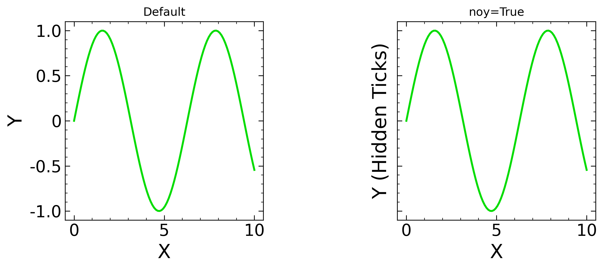

### 1-4. 枠の事前生成とネイティブ関数との連携 (`pre_set`)
`symple_plot` に実装されていないMatplotlib独自の描画関数（`fill_between`, `bar`, `errorbar` など）を使いたい場合、`pre_set` メソッドを使用します。これにより、データ範囲や美しい軸フォーマット（`cx`, `logx` など）だけを先に適用し、その後で自由にネイティブ関数を呼び出すことができます。

| メソッド / 引数 | 説明 |
| --- | --- |
| `pre_set(X, Y, **kwargs)` | X, Yのデータから軸範囲を計算し、`**kwargs` のフォーマットを適用した空の枠を作成します。 |

```python
import numpy as np
import matplotlib.pyplot as plt
from symple_plot import create_symple_plots

fig, sp_arr = create_symple_plots(1, 2, figsize=(12, 4))
x = np.linspace(0, 10, 100)
y_mean = np.sin(x)
y_err = 0.2 * np.ones_like(x)

# 左: pre_set で枠を作り、Matplotlibネイティブの fill_between を使う
ax = sp_arr[0].pre_set(x, y_mean, alab=["X", "Y (with Error)"], cx=[2, 8])
ax.plot(x, y_mean, color='blue')
ax.fill_between(x, y_mean - y_err, y_mean + y_err, color='blue', alpha=0.3)
sp_arr[0].ax.set_title("pre_set + ax.fill_between")

# 右: 通常のplot
sp_arr[1].plot(x, y_mean, alab=["X", "Y (Normal)"])
sp_arr[1].ax.set_title("Standard plot")

plt.show()
```

---

## 2. 複数パネルとレイアウト

### 2-1. グリッドプロットと軸の共有 (`sharex`, `sharey`)
複数パネル間で軸を共有したい場合、`create_symple_plots` に `sharex=True` や `sharey=True` を渡すことで、内部の目盛りラベルが整理された美しいグリッドプロットを作成できます。

| `create_symple_plots` の引数 | 型 | 説明 |
| --- | --- | --- |
| `sharex` | bool/str | `True`で全てのX軸を共有。`'col'`で列ごとに共有。 |
| `sharey` | bool/str | `True`で全てのY軸を共有。`'row'`で行ごとに共有。 |

```python
# sharex=True, sharey=True で内側の軸ラベルを省略して共通化
fig, sp_arr = create_symple_plots(2, 2, figsize=(10, 8), sharex=True, sharey=True)

x = np.linspace(0, 10, 100)
for i in range(4):
    sp_arr[i].plot(x, np.sin((i+1) * x), col='blue')
```
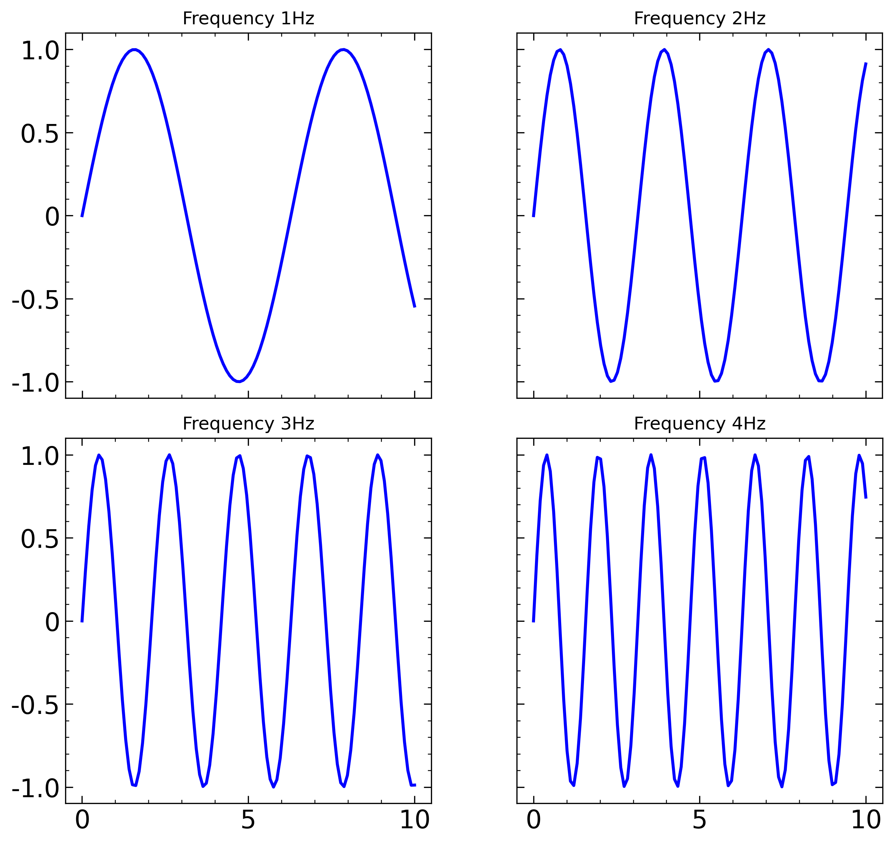

### 2-2. 隙間なしグリッド (Flush Grid)
`create_symple_plots` に `flush=True` を渡すだけで、パネル間の隙間をゼロにし、内側の軸ラベルを自動で非表示にした美しいマトリックスプロット（共有グリッド）を作成できます。同じ列ではX軸を、同じ行ではY軸を自動共有します。

| `create_symple_plots` の引数 | 型 | 説明 |
| --- | --- | --- |
| `flush` | bool | パネル間の隙間 (`wspace`, `hspace`) を0にし、軸を完全共有する |

```python
# flush=True を指定するだけで隙間なしの3x3グリッドを作成
fig, sp_arr = create_symple_plots(3, 3, figsize=(6, 6), flush=True)

# ... ループ処理の中で端のパネルにのみ alab_x, alab_y を設定
sp_arr[idx].plot(x, y, marker='.', alab=[alab_x, alab_y])
```
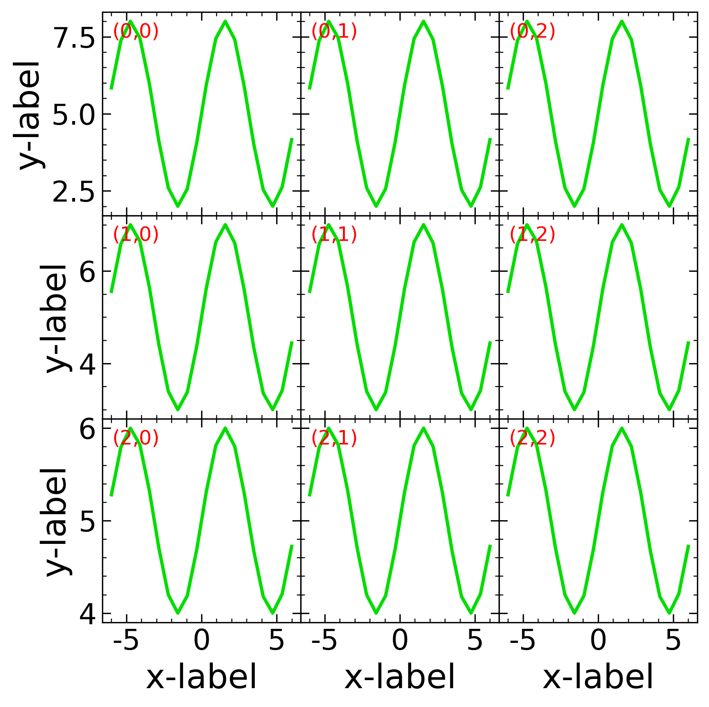

### 2-3. 第二軸とスケール変換 (Twin Axes & Secondary Axes)
スケールの異なる2つのデータを重ねたり、摂氏と華氏のように単位を変換して表示するための第二軸を簡単に生成できます。

| 専用メソッド | 説明 | 主な引数 |
| --- | --- | --- |
| `twinx()` | 同じX軸を持つ右側の第二Y軸を生成します。 | `col`, `alab` |
| `twiny()` | 同じY軸を持つ上側の第二X軸を生成します。 | `col`, `alab` |
| `secondary_xaxis()` | スケール変換用のX軸を生成します。 | `functions`, `location`, `alab` |
| `secondary_yaxis()` | スケール変換用のY軸を生成します。 | `functions`, `location`, `alab` |

```python
# 右軸: 指数データ (twinx を使用)
sp1_right = sp1_left.twinx(col='red', alab="Log Scale")
sp1_right.plot(x, np.exp(x), logy=True)

# 上軸: 華氏への変換関数(順関数)のみを渡す（逆関数はSciPyで自動生成されます）
sp2_bottom.secondary_xaxis(lambda c: c * 1.8 + 32, location='top', alab="Temperature (°F)")
```
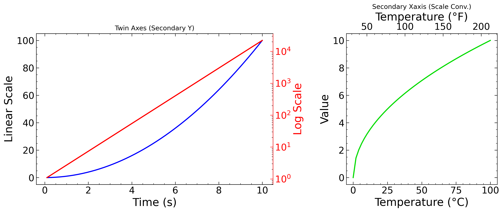

---

## 3. 視線誘導と注釈

### 3-1. Inset Zoom（自動探索・拡大小窓）
データの特定の部分を強調したい場合、`add_inset_zoom` メソッドで明示的に範囲を指定します。小窓内部に対しても `cx`, `cy` や `nox` などの基本引数が適用可能です。

| 描画時引数 / メソッド引数 | 型 | 説明 |
| --- | --- | --- |
| `zoomx` / `zoomy` | list | 描画時に `[min, max]` を渡すと自動で小窓を作成 |
| `bounds` | str/list | 小窓の配置。`'upper left'` や `[x, y, w, h]` など |
| `draw_lines` | bool | 小窓と元のグラフを繋ぐ補助線を描画するかどうか |

```python
sp.plot(x_bg, y_bg, col='gray')
sp.plot(x_peak, y_peak, col='green')
sp.add_inset_zoom(cx=[7.2, 7.8], bounds='upper left', noy=True)
```
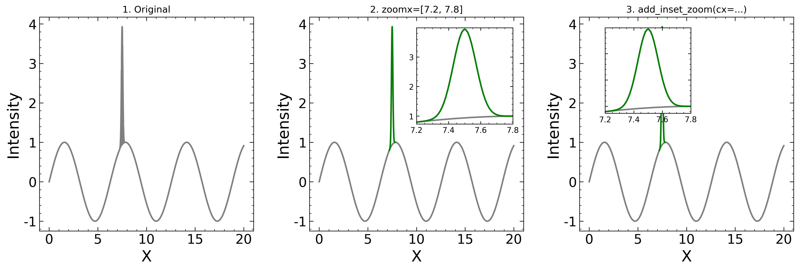

### 3-2. 個別カラー指定と強制ズーム (`zoom`)
`zoom` 引数を使って「直近で追加したデータ」の範囲にグラフ全体をピタッとフォーカスさせることができます。

| 引数名 | 型 | 説明 |
| --- | --- | --- |
| `col` | str | プロットの色（`'red'`, `'blue'`, `'grads'`など）を指定 |
| `zoom` | str | 今回渡したデータの範囲にグラフ枠を強制拡大。`'x'`, `'y'`, `'xy'` |

```python
sp.plot(x_bg, y_bg, col='gray', alab=["X", "Y"])
sp.plot(x_target, y_target, col='red', zoom='x') # 追加したTargetのX範囲にグラフを合わせる
```
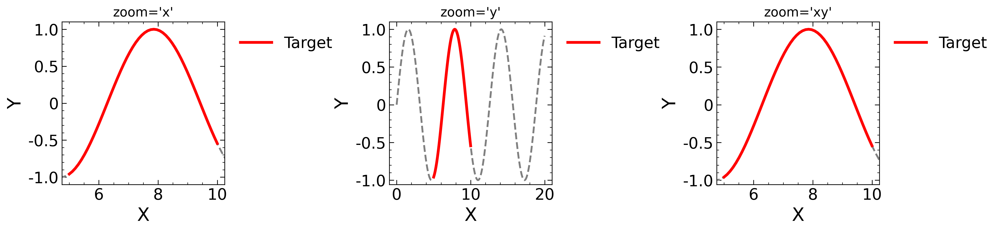

### 3-3. インラインラベル (Inline Labels)
データの端に直接凡例テキストを配置します。`loc='inline'` を指定すると、データの間隔が広い方を自動で判定し、プロットと同じ色でラベルを描画します。

| 引数名 | 型 | 説明 |
| --- | --- | --- |
| `loc` | str | `'inline'` で線の端に配置。`'inline_right'`などで固定も可。 |
| `lab_fs` | int | インラインラベルのフォントサイズ |
| `inline_dy` | float/list | 各ラベルのY座標の微調整オフセット |
| `inline_pad` | float | ラベルが切れないようにX軸を広げる割合 |

```python
sp.plot([x, x], [y1, y2], alab=["Time", "Yield"], lab=["Sample A", "Sample B"], 
        loc='inline', lab_fs=12, inline_dy=[0.3, -0.3])
```
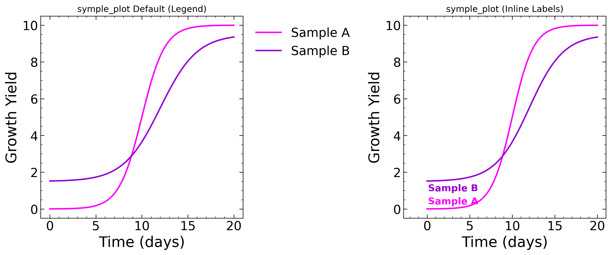

### 3-4. 論文・プレゼン用スタイルと自動ラベル (`style`, `auto_label`)
論文やスライド作成を加速するため、描画スタイルの一括適用と、各パネルへの `(a)`, `(b)` ラベルの自動付与をサポートしています。

| `create_symple_plots` の引数 | 型 | 説明 |
| --- | --- | --- |
| `style` | str | `'paper'` または `'slide'` で描画スタイル（フォントや線の太さ）を一括適用 |
| `auto_label` | bool | `True`で各パネルの左上に (a), (b)... と自動でラベルを付与 |

```python
import numpy as np
from symple_plot import create_symple_plots

# style='slide' で太字・大きな文字に設定。auto_label=True で (a), (b) を自動付与
fig, sp_arr = create_symple_plots(1, 2, figsize=(10, 4), style='slide', auto_label=True)

x = np.linspace(0, 5, 20)
sp_arr[0].plot(x, np.exp(x), alab=["Time", "Growth"], lab="Exponential")
sp_arr[1].scatter(x, x**3, alab=["Time", "Value"], size=80, marker='s', lab="Quadratic")
```
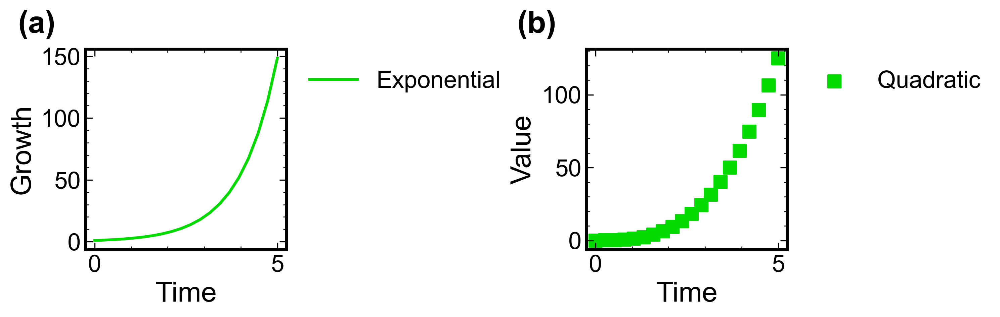

---

## 4. 解析と特殊プロット

### 4-1. 回帰分析と補助線 (`Regression`, `vx`, `hy`)
`Regression` メソッドは、多項式回帰や、`auto_p0=True` を用いたOptunaによる非線形フィッティングの初期値大域探索を自動実行します。また、`vx`や`hy`引数で簡単に補助線を引けます。

| 引数名 | 型 | 説明 |
| --- | --- | --- |
| `vx` / `hy` | list/float | 垂直線(x) または 水平線(y) を引く座標 |
| `vcol` / `hcol` | str | 補助線の色（デフォルト: `'gray'`） |
| `regr` | int/callable | [Regression専用] `int`で多項式の次数、関数で非線形フィット |
| `auto_p0` | bool | [Regression専用] SciPyによる初期値(`p0`)の大域探索を自動実行 |

```python
# 垂直な補助線を赤の破線で引く
sp.scatter(x, y, vx=[1, 3], vcol='red', vstyle='--')

# 任意の関数を定義してフィッティング
def exp_decay(x, a, b): return a * np.exp(-b * x)
sp.Regression(regr=exp_decay, auto_p0=True, n_trials=50, bounds=([0, 0], [10, 5]))
```
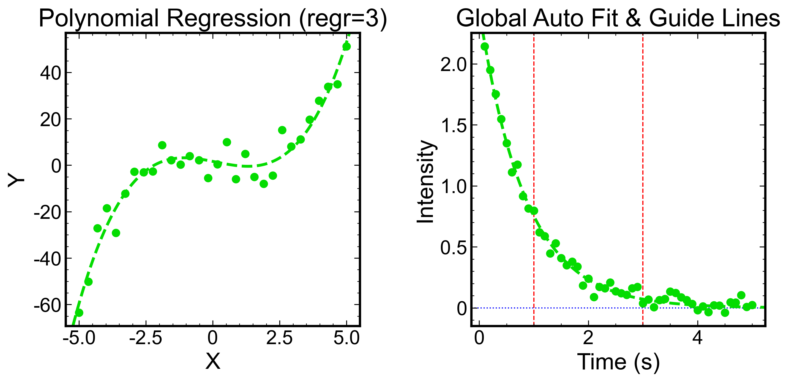